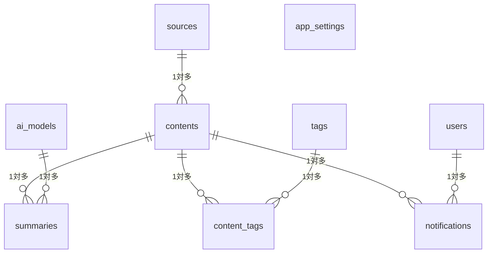

## テーブル・コレクション設計

### 1. ER 図 / スキーマ概要

**説明:**
- **sources** テーブルと **contents** テーブルが1対多
  - 1つのソース(sources)に対し、複数のコンテンツ(contents)が紐づく (YouTubeチャンネル → N件の動画)
- **contents** と **summaries** は1対多
  - 1つのコンテンツに対して、**複数のステップ要約結果**や**複数AIモデルの要約**が存在可能
  - （AI要約を段階的に実行する場合、それぞれをレコードとして保存）
- **contents** と **tags** は中間テーブル (**content_tags**) で多対多
- **notifications** は各コンテンツの通知履歴（誰がいつ送ったか、成功/失敗など）
- **users** と **notifications** が1対多 (通知操作を行ったユーザーを記録する等)
- **app_settings** はシステム全体の設定を単純なキー/バリュー形式で保存

---

### 2. テーブル定義例

#### 1. **sources** (監視対象: YouTube / RSS / arXiv etc.)

| カラム名        | 型            | 主キー | 備考                                        |
|----------------|---------------|-------|---------------------------------------------|
| `id`           | SERIAL        | ○     | ユニークID (AUTO INCREMENT)                 |
| `name`         | VARCHAR(100)  | ×     | ソース名 (例: “TechYouTuber”, “BlogX”など)     |
| `type`         | VARCHAR(50)   | ×     | ソース種別 (YouTube / RSS / arXiv など)       |
| `url`          | TEXT          | ×     | RSSフィードURL or チャンネルURLなど           |
| `active`       | BOOLEAN       | ×     | 有効/無効フラグ                               |
| `metadata`     | JSONB         | ×     | 追加メタ情報 (APIキー, サブフィード等)         |
| `last_checked` | TIMESTAMP     | ×     | 最終チェック日時                              |
| `created_at`   | TIMESTAMP     | ×     | 作成日時 (DEFAULT now())                     |
| `updated_at`   | TIMESTAMP     | ×     | 更新日時 (トリガ/アプリで自動更新)            |

#### 2. **contents** (動画/論文/記事など取得したコンテンツ)

| カラム名        | 型           | 主キー | 備考                                        |
|----------------|--------------|-------|---------------------------------------------|
| `id`           | SERIAL       | ○     | ユニークID (AUTO INCREMENT)                 |
| `source_id`    | INT          | ×     | sources.id へのFK                           |
| `external_id`  | VARCHAR(255) | ×     | YouTube動画ID, ブログ記事ID, 論文IDなど      |
| `title`        | TEXT         | ×     | コンテンツのタイトル                        |
| `description`  | TEXT         | ×     | 説明文 (要約とは別)                          |
| `url`          | TEXT         | ×     | 直接リンク(YouTube動画URL, 論文URL等)         |
| `type`         | VARCHAR(50)  | ×     | (動画/論文/ブログ等)                         |
| `published_at` | TIMESTAMP    | ×     | 公開日時 (RSSやAPIから取得)                  |
| `raw_text`     | TEXT         | ×     | テキスト本文 (字幕や記事の全文など)           |
| `metadata`     | JSONB        | ×     | サムネURL等、追加メタ情報                     |
| `status`       | VARCHAR(50)  | ×     | 要約済み / 未要約 / エラー 等                |
| `notified_at`  | TIMESTAMP    | ×     | 通知済み日時                                  |
| `created_at`   | TIMESTAMP    | ×     | 作成日時                                     |
| `updated_at`   | TIMESTAMP    | ×     | 更新日時                                     |

#### 3. **ai_models** (AIモデル設定)

| カラム名            | 型           | 主キー | 備考                                                      |
|--------------------|--------------|-------|-----------------------------------------------------------|
| `id`               | SERIAL       | ○     | ユニークID                                                |
| `name`             | VARCHAR(100) | ×     | モデル表示名 (例: "GPT-3.5", "Claude-v1")                  |
| `provider`         | VARCHAR(50)  | ×     | OpenAI, Anthropic, Googleなど                             |
| `model_id`         | VARCHAR(100) | ×     | 実際のモデル指定 (例: "gpt-3.5-turbo")                     |
| `api_key_encrypted`| TEXT         | ×     | APIキー(暗号化 or 非表示)                                 |
| `default_settings` | JSONB        | ×     | トークン数等の既定パラメータ                              |
| `active`           | BOOLEAN      | ×     | 有効/無効フラグ                                           |
| `is_default`       | BOOLEAN      | ×     | デフォルト使用モデルかどうか                              |
| `created_at`       | TIMESTAMP    | ×     | 作成日時                                                  |
| `updated_at`       | TIMESTAMP    | ×     | 更新日時                                                  |

#### 4. **summaries** (要約結果)

| カラム名         | 型         | 主キー | 備考                                                                |
|-----------------|------------|-------|---------------------------------------------------------------------|
| `id`            | SERIAL     | ○     | ユニークID                                                          |
| `content_id`    | INT        | ×     | contents.id へのFK                                                  |
| `ai_model_id`   | INT        | ×     | ai_models.id へのFK                                                 |
| `stage`         | VARCHAR(50)| ×     | 要約の段階 (例: "概要", "見出し", "詳細" など可変)                    |
| `summary_text`  | TEXT       | ×     | 要約本文                                                             |
| `prompt_used`   | TEXT       | ×     | 要約生成に使ったプロンプト (オプション)                              |
| `tokens_used`   | INT        | ×     | 消費トークン数 (将来のコスト計算に使える)                            |
| `processing_time` | INT      | ×     | 要約処理にかかった時間(ms等)                                         |
| `metadata`      | JSONB      | ×     | 追加情報（スコア等）                                                 |
| `created_at`    | TIMESTAMP  | ×     | 作成日時                                                            |

**ポイント**:
- **`stage`** カラムを追加し、複数段階の要約(概要→見出し→詳細 など)を柔軟に保存
- 例えば同じ content_id に対して stage="overview", stage="heading", stage="detail" 等を追加可能

#### 5. **notifications** (通知履歴)

| カラム名       | 型         | 主キー | 備考                                                                |
|---------------|------------|-------|---------------------------------------------------------------------|
| `id`          | SERIAL     | ○     | ユニークID                                                          |
| `content_id`  | INT        | ×     | contents.id へのFK                                                  |
| `summary_id`  | INT        | ×     | summaries.id へのFK (どの要約を使って通知したか)                     |
| `destination` | TEXT       | ×     | 送信先 (Discord Webhook URL 等)                                     |
| `status`      | VARCHAR(50)| ×     | 成功/失敗                                                           |
| `metadata`    | JSONB      | ×     | 実際に送信したEmbed内容やエラーメッセージなど                         |
| `sent_at`     | TIMESTAMP  | ×     | 送信完了日時                                                         |
| `created_at`  | TIMESTAMP  | ×     | レコード作成日時                                                    |

#### 6. **tags** (タグ管理)

| カラム名     | 型           | 主キー | 備考                                      |
|-------------|--------------|-------|-------------------------------------------|
| `id`        | SERIAL       | ○     | ユニークID                                |
| `name`      | VARCHAR(100) | ×     | タグ名 (例: "AI", "Tech", "論文")           |
| `color`     | VARCHAR(20)  | ×     | カラーコード(hex等)                       |
| `created_at`| TIMESTAMP    | ×     | 作成日時                                  |

#### 7. **content_tags** (コンテンツとタグの中間テーブル)

| カラム名      | 型       | 主キー | 備考                             |
|--------------|----------|-------|----------------------------------|
| `content_id` | INT      | ×     | contents.id へのFK               |
| `tag_id`     | INT      | ×     | tags.id へのFK                   |
| `created_at` | TIMESTAMP| ×     | レコード作成日時                 |

#### 8. **users** (管理者ユーザー)

| カラム名       | 型           | 主キー | 備考                                                    |
|---------------|--------------|-------|---------------------------------------------------------|
| `id`          | SERIAL       | ○     | ユニークID                                              |
| `email`       | VARCHAR(255) | ×     | ログイン用メールアドレス                                |
| `name`        | VARCHAR(100) | ×     | ユーザー表示名                                          |
| `password_hash` | TEXT       | ×     | パスワードのハッシュ (bcrypt等)                          |
| `role`        | VARCHAR(50)  | ×     | 管理者 / 一般ユーザーなど                                |
| `last_login`  | TIMESTAMP    | ×     | 最終ログイン日時                                         |
| `created_at`  | TIMESTAMP    | ×     | 作成日時                                                |
| `updated_at`  | TIMESTAMP    | ×     | 更新日時                                                |

#### 9. **app_settings** (システム設定)

| カラム名   | 型           | 主キー | 備考                                      |
|-----------|--------------|-------|-------------------------------------------|
| `key`     | VARCHAR(100) | ○     | 設定項目名 (例: "cron_youtube_interval")   |
| `value`   | TEXT         | ×     | 設定値                                     |
| `description`| TEXT      | ×     | 項目の説明                                 |
| `updated_at` | TIMESTAMP | ×     | 更新日時                                  |

---

### 3. 正規化・冗長化の方針

- 基本的には **第3正規形** 付近を目標にしつつ、将来の柔軟性のために **JSONB (metadata)** を併用
- 要約結果 (summaries) を **content_id** + **ai_model_id** + **stage** で差異を管理し、
  - 同一コンテンツに対して「概要」「見出し」「詳細」など複数段階の要約を保持
- タグは多対多のため **content_tags** で管理
- インポートや機能追加に備え、**metadata** カラムをうまく活用してスキーマ変更を最小限に

---

### 4. インデックス戦略

- **contents (source_id)**: ソース別検索に対応
- **contents (external_id)**: 一意制約 or ユニークインデックス (同じ外部IDを2重登録しないように)
- **summaries (content_id, ai_model_id, stage)**: 同一コンテンツ+モデル+段階の組合せで取得高速化
- **notifications (content_id)**: コンテンツ別通知履歴検索
- **tags (name)**: ユニークにするかは運用次第
- **users (email)**: ログイン用にユニークインデックス

Supabase(PostgreSQL)環境なら **JSONB** 用の GIN インデックスも検討可能。

---

### 5. 今後の拡張

1. **追加カラム (例: translations, rating)**
   - AI要約をさらに翻訳した結果や品質評価を保存したい場合、**summaries** テーブルに `metadata` を活用する or カラム追加
2. **データマイグレーション**
   - Supabase CLI / バージョン管理ツールを使って安全に実施
   - 大量データ移行時はバックアップ必須
3. **大規模化**
   - Supabase 有料プラン or PostgreSQL レプリケーション対応
   - 需要が増えたら シャーディング / テーブル分割
4. **AI要約の段階的ステップ**
   - “概要”(stage="overview") → “見出し”(stage="heading") → “詳細”(stage="detail") …
   - ステップ数は不定でも, `stage` 列があれば柔軟に対応可能
5. **全文検索**
   - raw_text が増大し検索需要が高まれば PostgreSQLの全文検索 or Elasticsearchを追加
6. **監査ログ / アクセス履歴**
   - 大量発生時に別テーブルor外部ストレージを利用

---

**まとめ**
- スキーマ定義は**段階的なAI要約**に対応するため、**summaries** テーブルに**`stage`** カラムを追加
- **JSONB** カラムを活用し、柔軟かつ小さな変更で拡張が可能
- 初期は Supabase (PostgreSQL) の無料枠で運用し、**データ量・負荷が増えれば有料プランやレプリケーション**に移行
- これにより「**お金をかけずに**」「**容易に**」「**将来的な機能追加**」にも対応できるデータ構造を実現。